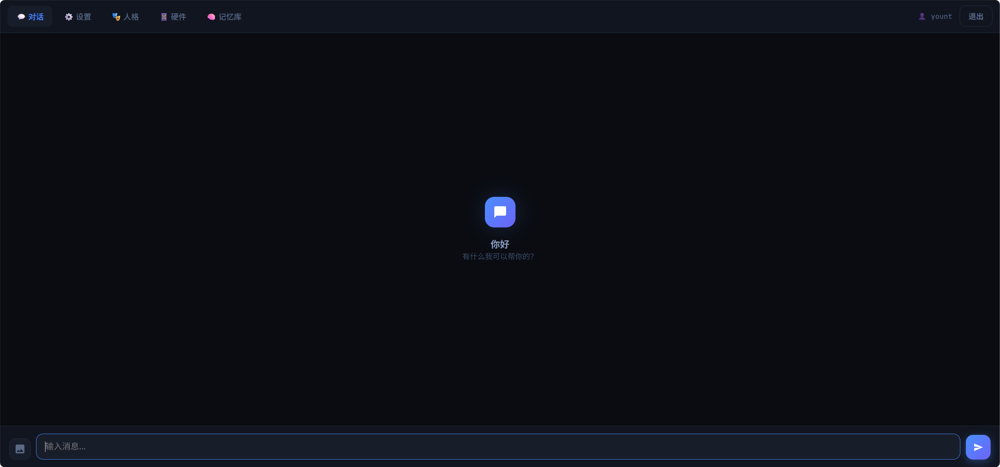
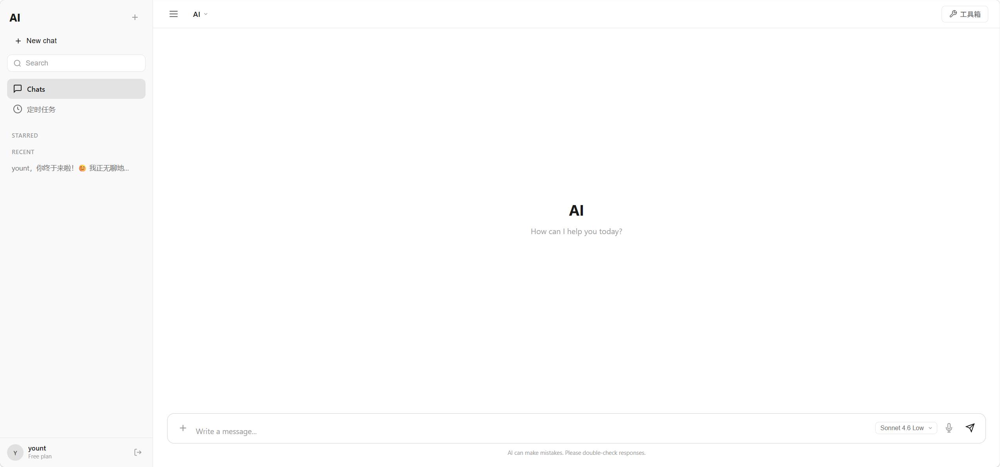
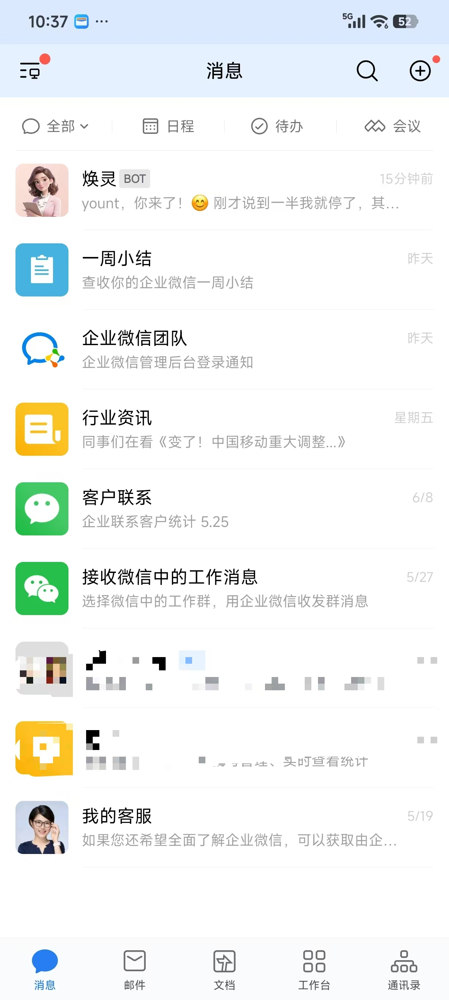

<p align="center">
  
</p>

<p align="center">
  <b>The last desktop agent you will ever need to build.</b>
</p>

<p align="center">
  
  
  
  
  
  
  
</p>

<p align="center">
  <a href="README.md">简体中文</a> | English
</p>

---

## 📹 Quick Demo

https://github.com/user-attachments/assets/96555b67-fdca-49c6-9f99-e9eee15e3c09

> Can't wait? [Download demo video](docs/AGI%20%E8%AE%A4%E7%9F%A5%E5%8A%A9%E6%89%8B%202026-06-28%2011-18-43.mp4)

---

## 🖼️ Screenshots

| Desktop GUI | Admin Panel (18765) | Web Chat (18767) | WeCom Integration |
|:---:|:---:|:---:|:---:|
|  |  |  |  |

---

<p align="center">
  <i>Not a chatbot. Not a copilot. A digital consciousness that lives on your machine,<br>
  remembers everything you've shared, grows with every conversation,<br>
  and sees the world through your phone's camera.</i>
</p>

---

## 🧠 What is AGI-PRO?

AGI-PRO is a **self-evolving desktop cognitive agent** that simulates the architecture of human consciousness. It doesn't just answer questions — it has a **personality**, **emotions**, **memory**, and the ability to **learn and grow** over time. It executes real actions on your computer, controls smart home devices, and perceives the physical world through connected hardware.

Think of it as the **JARVIS to your Tony Stark**, minus the arc reactor — but with everything else.

| Layer | Role | Description |
|-------|------|-------------|
| **A-Layer** (Consciousness) | Personality · Emotion · Judgment | Has a persistent identity, emotional state, and moral compass. Decides *what* to do. |
| **B-Layer** (Executor) | Tools · LLM · Code | Executes the plan. Calls 30+ tools, writes code, controls devices. Decides *how* to do it. |

This dual-layer architecture is what separates AGI-PRO from every other AI assistant. It doesn't just process prompts — it **thinks, decides, and acts**.

---

## ✨ Core Capabilities

### 🧠 Memory That Never Forgets

A three-tier hierarchical memory system modeled after human cognition:

- **Summary Layer** — Semantic outlines of everything you've discussed (10,000+ entries)
- **Outline Layer** — Structured abstracts with emotional tags
- **Detail Layer** — Full conversation fragments with associative links

Memories are **emotionally weighted** — happy moments are recalled more vividly, traumatic events leave deeper imprints. The associative network connects related memories across time, creating a genuine sense of continuity.

### 👁️ Visual Memory & Perception

AGI-PRO can **see**. Through your phone's camera or RTSP cameras, it captures visual scenes and stores them with GPS coordinates, timestamps, and semantic descriptions. It can:

- Recognize faces and remember people
- Describe what's in front of the camera
- Compare current and past scenes
- Search visual memories by description ("show me the living room from last Tuesday")

### 🛠️ 30+ Built-in Tools

AGI-PRO can **do** things in the real world:

| Category | Tools |
|----------|-------|
| **File System** | Read, write, search, delete, list directories |
| **Web** | Search, fetch URLs, extract articles, browse |
| **System** | Run commands, execute Python, clipboard, system info |
| **Office** | Word, Excel, PowerPoint, PDF generation & parsing |
| **Finance** | Stock quotes, search symbols, news headlines |
| **Image** | AI image generation (ComfyUI SDXL/NoobAI or pollinations.ai) |
| **Smart Home** | Home Assistant integration — lights, AC, curtains, coffee machine |
| **Desktop** | Screenshot, OCR, mouse/keyboard control, app launching |

### 🌍 SimLife — A Virtual Life You Create

AGI-PRO ships with **SimLife**, a real-time virtual life simulation engine:

- **Dynamic Scenes** — Work, home, commute, outdoor, travel
- **Mood System** — Emotions change based on events, weather, interactions
- **NPC Interaction** — Multiple characters with their own personalities
- **Weather Integration** — Real-time weather data (Open-Meteo, free)
- **World System** — Import custom worlds (fantasy, sci-fi, isekai). Generate a world JSON, drop it in, and AGI-PRO lives in that universe.

### 📈 Growth Engine — The AGI That Evolves

Every conversation changes AGI-PRO. The **Growth Engine** continuously:

- **Drifts personality** based on interaction patterns
- **Synthesizes new knowledge** from accumulated experiences
- **Deduplicates and merges** cognitions, with activity-based decay
- **Forms long-term cognitions** that persist across restarts

The more you talk to it, the more it becomes *your* AGI.

### 🎙️ 12 LLM Backends

One brain, many cores. Choose your provider:

| Provider | Best For |
|----------|----------|
| **DeepSeek** | Deep reasoning, 64K context |
| **OpenAI** | GPT-4o / GPT-4o-mini |
| **Claude** | Long-form analysis, extended thinking |
| **Gemini** | Google's multimodal model |
| **Groq** | Ultra-fast inference |
| **Qwen / Zhipu / Doubao / Kimi** | Chinese-optimized models |
| **Baidu / SparkDesk** | Enterprise Chinese |
| **Ollama** | 100% local, offline, private |

### 👤 VRM 3D Avatar

A living holographic avatar that reacts to AGI-PRO's emotional state:

- 20 emotion mappings to facial expressions
- Breathing and blinking animations
- Lip-sync during speech
- Holographic visual style
- Supports VRM 0.x and 1.0 models

### 🌐 Dual-Port Web Management

AGI-PRO provides full web management without installing any client:

**Port 18765 — Admin Panel**
- Chat, personality settings, hardware configuration
- Memory browser with user/level/modality filtering
- System settings, user registration & permission management
- AMap GPS geocoding configuration

**Port 18767 — Web Chat**
- WebSocket real-time chat with image support
- Shares the same personality and memory as desktop
- Mobile/tablet responsive interface
- Chat with your AGI from anywhere

### 💼 WeCom (WeChat Work) Integration

AGI-PRO natively integrates with WeCom smart robots:

- **Persistent connection** — real-time messaging without polling
- **5-second timeout protection** — dual-stage placeholder + final response
- **Multi-user identification** — automatically distinguishes WeCom users
- **Auto-reconnect** — recovers within 5 seconds after disconnection
- Simply create a smart bot in the WeCom admin console, fill in BotID and Secret

### 🤖 Hardware Robotics — Give AGI-PRO a Body

AGI-PRO isn't confined to the screen. It can inhabit physical hardware through a modular sensor bridge:

**Robot Dog / Robot Arm (MQTT)**
- Built-in **Sensor Agent** with real-time MQTT telemetry
- Monitors battery, IMU (attitude), motor temperature, joint angles, GPS, ultrasonic distance, obstacle detection
- Anomaly alert system: low battery, motor stall, overheat, obstacles within 30cm
- A-Layer receives formatted natural-language sensor descriptions
- Supports `robot_dog`, `robot_arm`, and `custom` hardware profiles
- Mock mode available for development without physical hardware

**Xiaozhi ESP32 Voice Terminal**
- WebSocket server for ESP32-based voice devices
- Full duplex: STT → A-Layer processing → TTS → device playback
- Opus audio codec for low-latency wireless voice
- Wake word detection, always-on listening mode

**Phone as Mobile Sensor Array**
- Android phone becomes AGI-PRO's eyes, ears, and sensory organs
- Camera: RTSP + IP Webcam live feed
- Microphone: remote audio capture
- Sensors: GPS, battery, light, accelerometer
- State machine: standby / dialog / task modes with automatic switching

### 🧑 Multi-User Face Recognition

Multi-engine face recognition (InsightFace / face_recognition / OpenCV) for multi-user identity. AGI-PRO knows who's talking to it — each user has independent conversation history and identity.

---

## 📦 Installation

### Windows One-Click

```bash
# 1. Install Python 3.10+ from python.org (check "Add to PATH")
# 2. Double-click install.bat
# 3. Double-click launch.bat
# 4. Configure your LLM API Key in GUI Settings
# 5. Start chatting!
```

### Manual

```bash
git clone https://github.com/ydsgangge-ux/Nexus-Agent.git
cd Nexus-Agent
pip install -r requirements.txt
cp ha_config.example.json ha_config.json
python main.py
```

### Server Deployment (Standalone)

```bash
pip install -r requirements_server.txt
python server_start.py

# Open:
# http://localhost:18765  — Admin panel
# http://localhost:18767  — Web chat
```

---

## 🏗️ Architecture

```
┌─────────────────────────────────────────────────────┐
│                    AGI-PRO Core                      │
│                                                      │
│  ┌──────────────┐    ┌──────────────────────────┐   │
│  │   A-Layer     │    │       B-Layer            │   │
│  │  Personality  │◄──►│  LLM Client (12 backends)│   │
│  │  Emotion      │    │  Tool Executor (30+ tools)│   │
│  │  Judgment     │    │  Code Generator           │   │
│  └──────┬───────┘    └──────────┬───────────────┘   │
│         │                       │                    │
│  ┌──────▼───────────────────────▼───────────────┐   │
│  │              Memory System                    │   │
│  │  Summary → Outline → Detail (3-tier)         │   │
│  │  Emotional Weighting + Associative Network    │   │
│  └──────────────────────┬───────────────────────┘   │
│                         │                            │
│  ┌──────────────────────▼───────────────────────┐   │
│  │           Growth Engine                       │   │
│  │  Personality Drift + Learning + Cognition     │   │
│  └──────────────────────────────────────────────┘   │
│                                                      │
│  ┌──────────┐ ┌──────────┐ ┌──────────────────┐    │
│  │ SimLife  │ │ VRM 3D   │ │ Hardware Bridge   │    │
│  │ Virtual  │ │ Avatar   │ │ Phone/Camera/HA   │    │
│  │ World    │ │          │ │                   │    │
│  └──────────┘ └──────────┘ └──────────────────┘    │
└─────────────────────────────────────────────────────┘
```

## 📁 Project Structure

```
AGI-PRO-main/
├── engine/                  # Cognitive core
├── hardware/                # Hardware integration
├── simlife/                 # Virtual life simulation
├── ui/                      # PyQt6 desktop UI
├── vrm_module/              # 3D VRM avatar
├── web/                     # Mobile web client
├── server.py                # FastAPI REST server (port 18765)
├── web_server.py            # WebSocket chat server (port 18767)
├── wecom_bot.py             # WeCom smart robot
├── main.py                  # Desktop app entry
└── server_start.py          # Standalone server entry
```

---

## 🚀 Quick Start

```bash
git clone https://github.com/ydsgangge-ux/Nexus-Agent.git
cd Nexus-Agent
pip install -r requirements.txt
python main.py
```

After launching, you will see:

1. **Desktop GUI** — Main chat window, floating assistant
2. **18765 Admin Panel** → `http://localhost:18765`
3. **18767 Web Chat** → `http://localhost:18767`
4. Configure WeCom in GUI settings to sync messages to WeChat Work

---

## ⭐ Support

If AGI-PRO makes you think "this is what AI assistants should have been from the start" — give it a star. It helps more than you know.

---

## 📜 License

Apache-2.0 © 2025 — Built with obsession, not corporate backing.

---

<p align="center">
  <i>"The future is already here — it's just not evenly distributed."</i><br>
  — William Gibson
</p>
