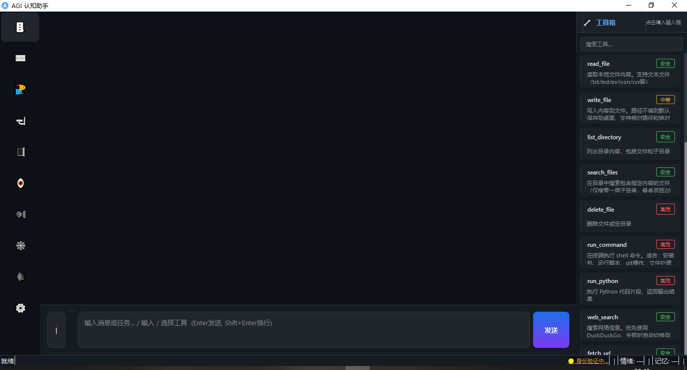

# AGI Cognitive Assistant

<p align="center">
  <b>A desktop AI assistant that simulates human cognitive architecture</b><br>
  layered memory · emotional weighting · associative retrieval · personality growth
</p>

<p align="center">
  
  
  
  
</p>

<p align="center">
  English | <a href="README.md">简体中文</a>
</p>

---

## Features

- **A/B Dual Architecture** — Layer A (consciousness) has personality, emotions, judgment; Layer B (executor) calls LLM + tools
- **Dynamic Thinking Mode** — Perception layer automatically judges question complexity; simple questions get fast responses (saves tokens), complex questions enable deep reasoning (high quality). Three switchable modes (auto/always on/always off), decision path observable in server logs
- **Hierarchical Memory** — SQLite + vector retrieval, three-tier storage (outline/detail/fragment) + associative network + two-phase retrieval
- **User Profile** — Gradually accumulates personality traits, detects anomalous behavior, identity verification
- **28 Built-in Tools** — File operations, system control, web search, browser automation, OCR, coding agent, Office I/O, stock info, news, **AI image generation**
- **AI Image Generation** — Auto-generates character selfies & scenery using pollinations.ai (free, no API key); proactive periodic generation (~3h); chat bubble image display; personality-bound avatar prompts with AI auto-generation
- **SimLife Virtual Life** — Virtual life system: real-time scene engine (work/home/commute/outdoor/travel), daily events, mood system, NPC interaction, weather integration (Open-Meteo, free), holiday calendar, schedule management. Auto-starts with main app. First-time setup via built-in web UI (`http://127.0.0.1:87659`)
- **SimLife World System** — Experience isekai-style communication! Besides the default modern world, import custom world settings (fantasy/sci-fi/isekai). Users generate setting packs via external LLMs (JSON), which auto-inject into character generation, activity descriptions, and event systems. Built-in world template and generation prompts, one-click switching
- **Growth Engine** — Personality drift + active learning + experiential cognition with deduplication & activity decay — the AGI evolves through conversation
- **Mobile Web Client** — Built-in web server (FastAPI), chat from any phone browser, shares the same agent instance and memory as desktop
- **Proactive Conversation** — AGI initiates topics autonomously; user replies are stored as complete memory chains (system→user→AI), proactive messages carry identity tags so AI correctly distinguishes its own messages from user messages
- **12 LLM Providers** — DeepSeek / OpenAI / Claude / Gemini / Groq / Qwen / Zhipu / Doubao / Kimi / Baidu / SparkDesk / Ollama (100% local)
- **Multi-language** — Chinese / English / 日本語 / 한국어 / Español / العربية
- **Voice Synthesis** — Microsoft Edge TTS, multiple voices
- **Face Recognition** — Multi-engine (InsightFace / face_recognition / OpenCV), multi-user identity
- **Desktop Integration** — System tray, global hotkeys, floating window, screenshot OCR, auto-start
- **VRM Virtual Avatar** — Embedded VRM 3D character panel with emotion sync (20 emotion mappings), speaking animation, breathing/blink lifelike animations, holographic visual style. Supports VRM 0.x / 1.0 models. Modular loading with graceful degradation

---

## Quick Start

### Windows (recommended)

1. **Install Python 3.10+** from https://www.python.org/downloads/
   - **Must check** `Add Python to PATH`
2. **Double-click `install.bat`** — installs all dependencies
3. **Double-click `launch.bat`** — starts the app

That's it! Two clicks after Python is installed.

### Linux / macOS

```bash
# 1. Make sure Python 3.10+ and pip are installed
# Ubuntu: sudo apt install python3 python3-pip
# macOS:   brew install python3

# 2. Install dependencies
chmod +x install.sh launch.sh
./install.sh

# 3. Launch
./launch.sh
```

---

## Screenshots

| Main Chat | Tool Panel | Settings |
|:---------:|:----------:|:--------:|
|  |  |  |

---

## Project Structure

```
agi_app/
├── main.py                  # Entry point (PyQt6 desktop app)
├── server.py                # Mobile web server (FastAPI, shares agent instance)
├── install.bat / install.sh # One-click install scripts
├── launch.bat / launch.sh   # Launch scripts
├── build.py                 # PyInstaller packaging script
├── requirements.txt         # Python dependencies
│
├── engine/                  # AGI Core Engine
│   ├── models.py            # Data models (personality/memory/emotion/modality)
│   ├── memory.py            # SQLite vector memory store (CRUD + decay)
│   ├── memory_manager.py    # Hierarchical retrieval (two-phase retrieval)
│   ├── association.py       # Memory association network (directed weighted graph)
│   ├── agent.py             # Layer A consciousness agent (perceive→memory→reason→tool→generate)
│   ├── executor.py          # Layer B tool execution loop (ReAct, max 8 steps)
│   ├── tools.py             # 28 tool functions
│   ├── image_gen.py         # AI image generation (pollinations.ai, selfie & scenery)
│   ├── coder.py             # Autonomous coding agent (write→run→fix loop)
│   ├── office_tools.py      # Office file tools (docx/xlsx/pptx/pdf)
│   ├── user_profile.py      # User profile (trait accumulation + anomaly detection)
│   ├── learner.py           # Growth engine (personality drift + active learning + cognition dedup/decay)
│   ├── auth.py              # Multi-user identity verification
│   ├── face_recognition_engine.py  # Face recognition (three-engine lazy-load)
│   ├── llm_client.py        # LLM client (DeepSeek/OpenAI/Groq/Claude/Gemini/Ollama)
│   ├── tts_engine.py        # Voice synthesis (Edge TTS / pyttsx3)
│   └── i18n.py              # Internationalization (6 languages)
│
├── desktop/                 # Desktop System Layer
│   ├── config.py            # Config management, paths, QSS dark theme
│   ├── system.py            # System tray, global hotkeys, auto-start
│   └── screenshot.py        # Screenshot selector + OCR background thread
│
├── simlife/                 # SimLife Virtual Life Simulation
│   ├── backend/             # FastAPI backend (auto-starts with main app)
│   │   ├── main.py          # Server entry + API routes (port 8769)
│   │   ├── world_engine.py  # Scene engine (schedule + weather + holidays)
│   │   ├── event_engine.py  # Daily/random/scheduled event system
│   │   ├── mood_engine.py   # Mood calculation (scene + events + weather)
│   │   ├── npc_engine.py    # NPC activation and interaction
│   │   ├── weather.py       # Open-Meteo weather (free, no API key)
│   │   ├── generator.py     # LLM character/NPC generation (auto world injection)
│   │   └── holiday_calendar.py  # Chinese holidays + festivals
│   ├── frontend/            # Setup web UI (initial character creation)
│   ├── data/                # Runtime data (character, world state, events)
│   ├── worlds/              # World Setting System
│   │   ├── world_manager.py       # World load/switch/injection manager
│   │   ├── world_setting_template.json  # 13-dimension world template
│   │   └── generate_world_prompt.md     # Prompt template for world generation
│   └── setup.py             # Standalone setup launcher
│
├── vrm_module/              # VRM Virtual Avatar Module (optional)
│   ├── __init__.py          # Safe loading entry (exception-catch all)
│   ├── vrm_widget.py        # PyQt6 QWebEngineView component
│   ├── emotion_bridge.py    # Emotion mapping (AGI emotions → VRM BlendShape)
│   ├── static/              # Three.js rendering assets
│   │   ├── vrm_viewer.html  # Three.js + three-vrm rendering page
│   │   ├── three.module.js  # Three.js ES Module (offline)
│   │   ├── three-vrm.module.js  # three-vrm ES Module (offline)
│   │   └── model.vrm        # VRM model file (user-provided)
│   └── test_server.py       # Browser test server
│
└── ui/                      # UI Layer (PyQt6)
    ├── main_window.py       # Main window (7 functional tabs)
    └── float_window.py      # Floating window (topmost, draggable, animated, proactive replies)
```

---

## First-time Configuration

After launching, go to the **Settings** tab to configure:

| Setting | Description |
|---------|-------------|
| **LLM Provider** | DeepSeek / OpenAI / Groq / Claude / Gemini / Ollama |
| **API Key** | Get one from your provider's website (Ollama needs none) |
| **Hotkeys** | Customize wake and screenshot hotkeys |
| **Language** | Chinese / English / Japanese / Korean / Spanish / Arabic |

### Supported LLM Providers

| Provider | API Key URL | Notes |
|----------|-------------|-------|
| **DeepSeek** | https://platform.deepseek.com | Recommended, affordable |
| **OpenAI** | https://platform.openai.com | GPT-4o-mini etc |
| **Groq** | https://console.groq.com | Free tier available, fast |
| **Claude** | https://console.anthropic.com | Anthropic |
| **Gemini** | https://aistudio.google.com | Google |
| **Ollama** | https://ollama.ai | 100% local, no key needed |

> **Tool calling**: DeepSeek / OpenAI / Groq / Qwen / Zhipu / Doubao / Kimi / Baidu / SparkDesk use native function calling. Claude / Gemini / Ollama use ReAct prompt parsing (tool descriptions embedded in prompt, JSON output). All providers support real tool execution.

---

## Architecture Overview

```
User Input
    │
    ▼
① Perception (LLM) → Emotion / task type / topic tags / complexity (simple/complex)
    │
    ▼
② Two-phase Memory Retrieval
   Phase 1: Vector search outlines + associative ripple spread
   Phase 2: Pull details by outline direction
   + User profile (always injected)
    │
    ▼
③ Reasoning (LLM) → Decide tool usage, storage strategy
   └ Complex problems enable deep thinking, simple ones get fast response
    │
    ├── Needs tools ──→ ④ Layer B tool loop (ReAct, max 8 steps)
    │
    ▼
⑤ Generate Response (LLM) → Personality-driven output
    │
    ▼
⑥ Store → Layered memory by importance / emotion
    │
    ▼
⑦ Background → User profile / growth engine / experiential cognition
```

---

## Tool List (28)

| Category | Tools |
|----------|-------|
| **File System** | `read_file` · `write_file` · `list_directory` · `search_files` · `delete_file` |
| **Execution** | `run_command` · `run_python` |
| **Network** | `web_search` (DuckDuckGo + Bing) · `fetch_url` · `read_article` (newspaper3k) |
| **System** | `screenshot` · `mouse_click` · `keyboard_type` · `open_application` · `get_system_info` · `read_clipboard` · `write_clipboard` |
| **Browser** | `browser_action` (Playwright) |
| **Office** | `create_word` · `create_excel` · `create_pptx` · `create_pdf` · `read_office_file` |
| **Finance** | `get_stock_info` · `search_stock` |
| **News** | `get_news` · `get_news_sources` |
| **Image** | `generate_image` (pollinations.ai, free, no API key) |

All high-risk tools (`run_command`, `run_python`) require explicit user confirmation before execution.

---

## SimLife World System

SimLife supports custom world settings, enabling isekai-style communication — the AGI can roleplay as a character from fantasy/sci-fi worlds.

### How It Works

- **Modern World** (default): Cannot be deleted, uses original real-world theme
- **Custom Worlds**: Users generate world settings via external LLMs (JSON), which auto-inject into character generation, activity descriptions, and event generation
- **LLM Config Inheritance**: SimLife automatically uses the main system's LLM config, no separate setup needed

### Usage

1. Open `simlife/worlds/generate_world_prompt.md`, copy the prompt template
2. Paste into any LLM (e.g., DeepSeek, ChatGPT), customize the settings
3. Save the generated JSON as `world_setting.json`
4. Import via SimLife API: `POST http://127.0.0.1:8769/api/worlds/import`
5. Switch world: `POST http://127.0.0.1:8769/api/worlds/switch`, body: `{"world_id": "your_world_id"}`

### API Endpoints

| Endpoint | Method | Description |
|----------|--------|-------------|
| `/api/worlds` | GET | List all available worlds |
| `/api/worlds/current` | GET | Get current world |
| `/api/worlds/switch` | POST | Switch world |
| `/api/worlds/import` | POST | Import world setting |
| `/api/worlds/template` | GET | Get world template |

---

## Keyboard Shortcuts

| Shortcut | Action |
|----------|--------|
| `Ctrl+Shift+Space` | Show / hide floating window |
| `Ctrl+Shift+S` | Select area screenshot + OCR |

> Both hotkeys are customizable in Settings.

---

## Optional Enhancements

These are installed automatically by `install.bat`/`install.sh` if possible:

```bash
# Voice synthesis (Microsoft Edge TTS, free)
pip install edge-tts

# Mobile web server (chat from phone browser)
pip install fastapi uvicorn PyJWT

# Office file I/O (Word/Excel/PPT/PDF)
pip install python-docx openpyxl python-pptx reportlab pdfplumber

# Semantic vectors (improves memory retrieval quality, ~500MB)
pip install sentence-transformers

# Face recognition (InsightFace engine, recommended)
pip install insightface onnxruntime opencv-python

# Browser automation
pip install playwright && playwright install chromium

# Article extraction (intelligent news/article parser)
pip install newspaper3k

# Finance tools (stock info & search)
pip install yfinance

# News tools (requires API key from newsapi.org)
pip install newsapi-python

# VRM Virtual Avatar (PyQt6 WebEngine, optional, requires Python 3.12/3.13)
pip install PyQt6-WebEngine
```

Missing optional dependencies gracefully degrade — core features still work.

---

## VRM Virtual Avatar

Displays a 3D virtual character on the right side of the chat panel, with real-time emotion changes during conversation.

### Prerequisites

- Python 3.12 or 3.13 (3.14 not yet compatible with PyQt6-WebEngine)
- `pip install PyQt6-WebEngine`
- Place a `.vrm` model file at `vrm_module/static/model.vrm`

### Model Sources

- [VRoid Studio](https://vroid.com/studio) (free character creator)
- [VRoid Hub](https://hub.vroid.com) (free commercial-use models)

### Testing

```bash
python vrm_module/test_server.py
# Open http://localhost:8899 in browser
# Console test: setEmotion("happy", 0.9) / setSpeaking(true)
```

---

## Packaging as Standalone Executable

```bash
pip install pyinstaller
python build.py windows   # → dist/AGI-Desktop.exe
python build.py linux     # → dist/AGI-Desktop
```

---

## Data Storage

All data is stored in the user directory — project folder stays clean:

| Platform | Data Directory |
|----------|---------------|
| Windows | `%APPDATA%\AGI-Desktop\` |
| Linux/macOS | `~/.agi-desktop/` |

Core files:
- `config.json` — User settings (API keys, hotkeys, etc.)
- `personality.json` — Personality configuration
- `memory.db` — SQLite database (memory/associations/user profile/face/growth)

---

## Troubleshooting

### "Python is not installed" or "'python' is not recognized"

1. Download Python from https://www.python.org/downloads/
2. During installation, **check "Add Python to PATH"** (critical!)
3. Re-open Command Prompt and run `install.bat` again

### "No module named PyQt6"

Run `install.bat` again, or manually: `pip install -r requirements.txt`

### Garbled text in console

Right-click console title bar → Properties → Font → select a font that supports your language.

### Memory retrieval quality is poor

Install semantic vectors: `pip install sentence-transformers`

### Ollama tool calls don't work

Ollama doesn't natively support function calling. Use DeepSeek API for full tool support.

### VRM panel shows "WebEngine not installed"

Python 3.14 is not yet compatible with PyQt6-WebEngine. Please use Python 3.12 or 3.13. The VRM module is optional and won't affect the main application.

---

## Tech Stack

- **UI**: PyQt6 (dark theme)
- **LLM**: DeepSeek / OpenAI / Groq / Claude / Gemini / Ollama
- **Memory**: SQLite + sentence-transformers (optional)
- **Mobile**: FastAPI + Uvicorn + PyJWT
- **Voice**: Edge TTS / pyttsx3
- **Face**: InsightFace / face_recognition / OpenCV
- **Office**: python-docx / openpyxl / python-pptx / reportlab / pdfplumber
- **Browser**: Playwright (optional)
- **Finance**: yfinance
- **Article**: newspaper3k
- **Image**: pollinations.ai (free AI image generation)
- **Avatar**: Three.js + three-vrm + PyQt6-WebEngine (optional)

---

## License

[MIT](LICENSE)
